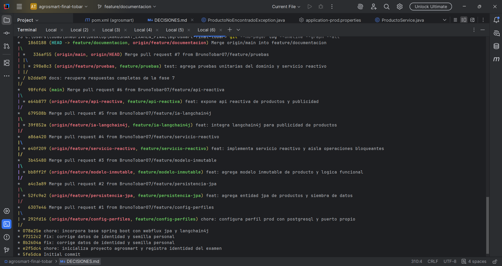
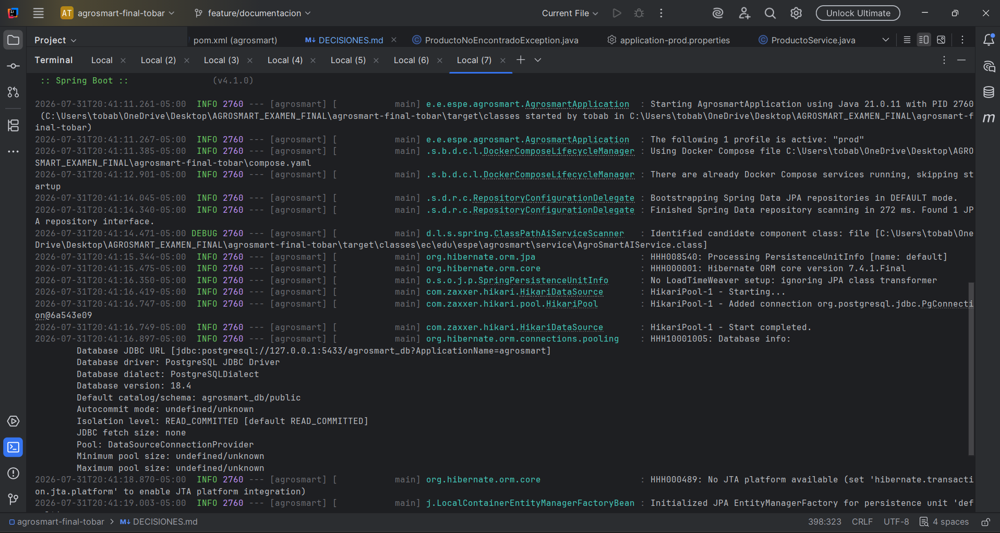
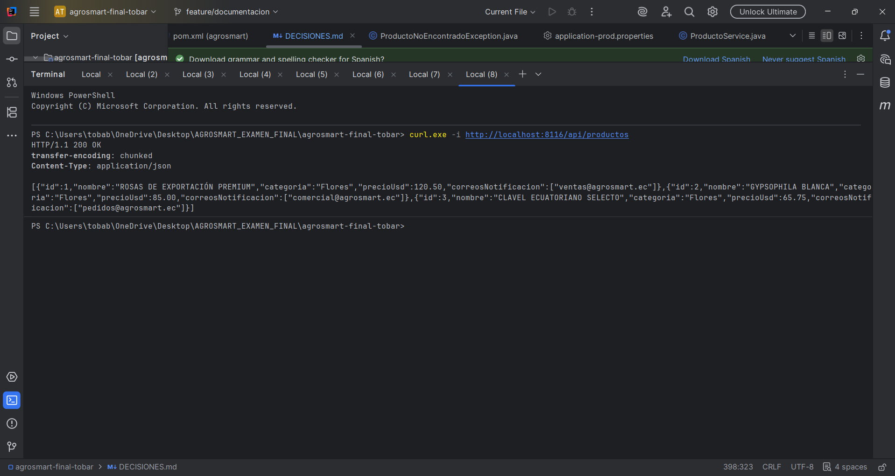
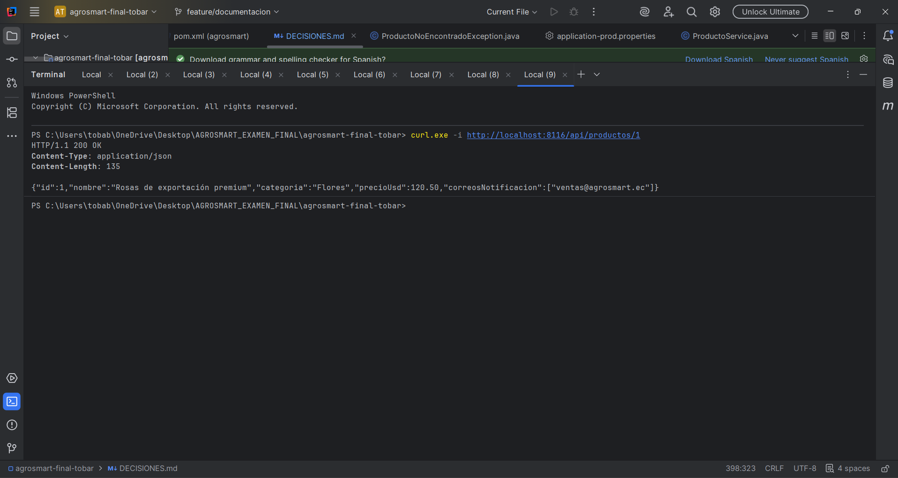
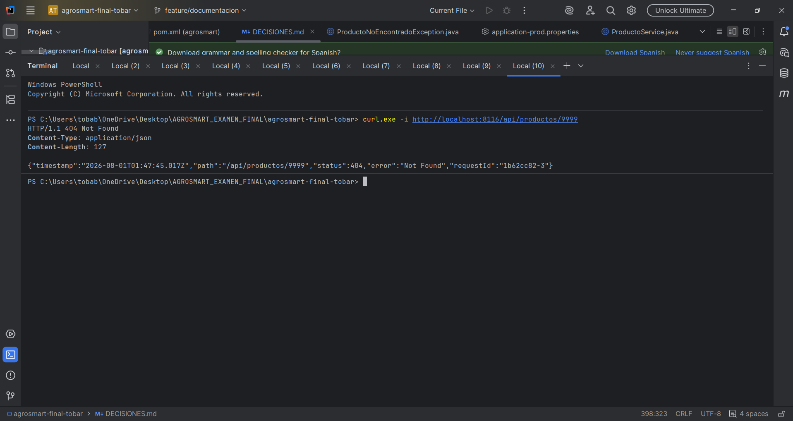
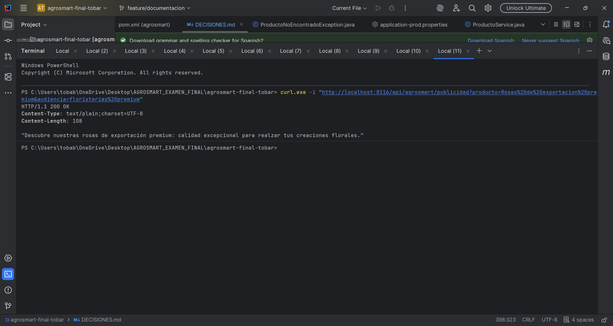
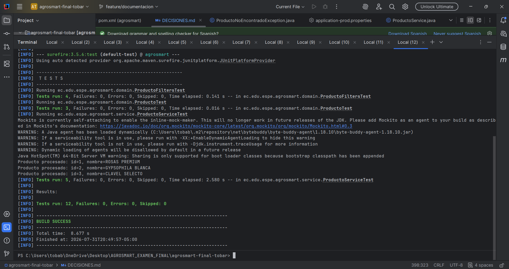
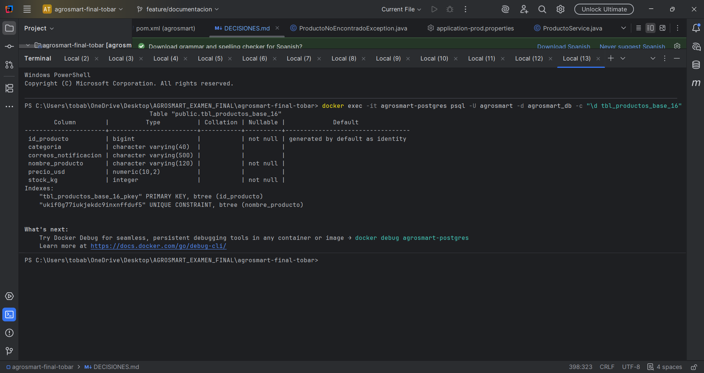
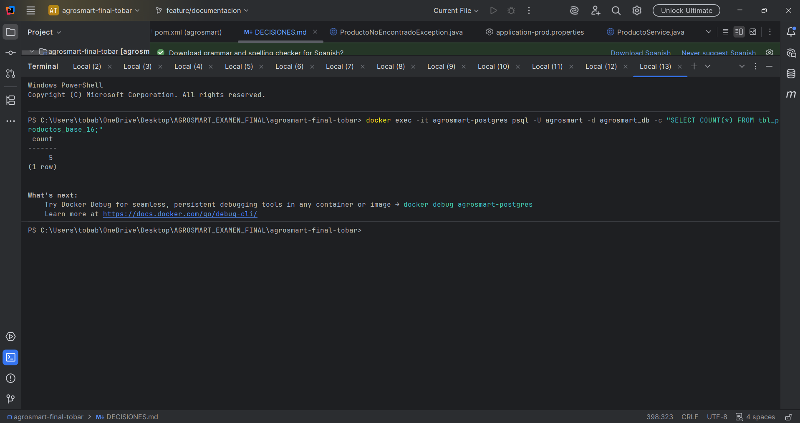

# AgroSmart – Examen Final de Programación Avanzada

Aplicación desarrollada con Spring Boot, WebFlux, JPA, PostgreSQL, Reactor y LangChain4j para administrar productos agrícolas y generar mensajes publicitarios mediante inteligencia artificial.

## Datos del estudiante

- **Estudiante:** Bruno Alejandro Tobar Iguasnia
- **Código del examen:** `AGS-2026`
- **Últimos dígitos de cédula:** `16`
- **Puerto asignado:** `8116`
- **Tabla personalizada:** `tbl_productos_base_16`
- **Categoría seleccionada:** Flores
- **Audiencia de publicidad:** Floristerías premium

## Tecnologías utilizadas

- Java 21
- Spring Boot
- Spring WebFlux
- Project Reactor
- Spring Data JPA
- PostgreSQL
- Docker Compose
- LangChain4j
- Maven
- JUnit
- Mockito
- StepVerifier
- Git y GitHub

## Arquitectura del proyecto

La aplicación está organizada en las siguientes capas:

- `controller`: expone los endpoints reactivos.
- `service`: contiene la lógica de negocio y los flujos con Reactor.
- `repository`: proporciona acceso bloqueante a PostgreSQL mediante JPA.
- `entity`: contiene la entidad persistente `ProductoEntity`.
- `domain`: contiene el modelo inmutable `Producto` y la lógica funcional.
- `mapper`: transforma entidades JPA en objetos del dominio.
- `exception`: contiene el manejo del producto inexistente.
- `config`: contiene la siembra inicial e integración de la aplicación.
- `ai`: contiene el servicio declarativo de LangChain4j.

## Modelo de datos

La aplicación utiliza la tabla:

```text
tbl_productos_base_16
```

La tabla contiene los campos:

- `id_producto`
- `nombre_producto`
- `precio`
- `stock`
- `categoria`
- `emails_notificacion`

Al iniciar la aplicación por primera vez se registran cinco productos. La siembra es idempotente, porque únicamente se ejecuta cuando la tabla no contiene registros.

De los cinco productos iniciales, tres cumplen las reglas para ser considerados comercializables:

1. Precio mayor que cero.
2. Al menos un correo de notificación.

Los productos con precio igual a cero o sin correos son descartados por el flujo reactivo.

## Configuración de PostgreSQL

PostgreSQL se ejecuta mediante Docker Compose en el puerto local `5433`.

Para levantar la base de datos:

```powershell
docker compose up -d
```

Para comprobar el estado del contenedor:

```powershell
docker compose ps
```

La base de datos utilizada es:

```text
agrosmart_db
```

## Ejecución de la aplicación

La aplicación utiliza el perfil activo `prod` y se ejecuta en el puerto `8116`.

En Windows:

```powershell
.\mvnw.cmd spring-boot:run
```

La URL base es:

```text
http://localhost:8116
```

## Endpoints disponibles

### Obtener productos comercializables

```http
GET /api/productos
```

Prueba mediante terminal:

```powershell
curl.exe -i http://localhost:8116/api/productos
```

Este endpoint devuelve únicamente los tres productos válidos y transforma sus nombres a mayúsculas.

### Consultar un producto por identificador

```http
GET /api/productos/{id}
```

Ejemplo con un producto existente:

```powershell
curl.exe -i http://localhost:8116/api/productos/1
```

Cuando el producto existe se devuelve:

```text
HTTP/1.1 200 OK
```

Ejemplo con un identificador inexistente:

```powershell
curl.exe -i http://localhost:8116/api/productos/9999
```

Cuando el producto no existe se devuelve:

```text
HTTP/1.1 404 Not Found
```

### Generar publicidad mediante IA

```http
GET /api/agrosmart/publicidad
```

Parámetros:

- `producto`: producto que se desea promocionar.
- `audiencia`: público al que se dirige la publicidad.

Ejemplo:

```powershell
curl.exe -i "http://localhost:8116/api/agrosmart/publicidad?producto=Rosas%20de%20exportacion%20premium&audiencia=floristerias%20premium"
```

El servicio utiliza LangChain4j para generar una frase publicitaria breve. Cuando el proveedor de inteligencia artificial no está disponible, la aplicación devuelve un mensaje alternativo para evitar que falle completamente la petición.

## Programación reactiva

El servicio devuelve tipos reactivos:

- `Flux<Producto>` para la lista de productos.
- `Mono<Producto>` para la consulta por identificador.
- `Mono<String>` para la generación de publicidad.

Entre los operadores utilizados se encuentran:

- `Mono.fromCallable(...)`
- `subscribeOn(...)`
- `flatMapMany(...)`
- `flatMap(...)`
- `map(...)`
- `filter(...)`
- `doOnNext(...)`
- `defaultIfEmpty(...)`
- `switchIfEmpty(...)`
- `timeout(...)`
- `onErrorResume(...)`

## Uso de boundedElastic

Spring Data JPA y el servicio externo de inteligencia artificial realizan operaciones bloqueantes. Por esta razón, esas llamadas se envuelven con `Mono.fromCallable(...)` y se ejecutan utilizando:

```text
.subscribeOn(Schedulers.boundedElastic())
```

Esto evita que la espera de PostgreSQL o del proveedor de IA bloquee los hilos del event loop de Netty. De esta manera, los hilos `reactor-http-nio-*` permanecen disponibles para atender otras solicitudes.

## Inmutabilidad y copias defensivas

La clase de dominio `Producto` es inmutable porque:

- Sus atributos son `private final`.
- No posee métodos `setter`.
- La lista de correos se copia al ingresar al constructor.
- El getter devuelve una nueva lista no modificable.

Esto evita que una colección externa modifique el estado interno del producto.

La lógica funcional se encuentra en `ProductoFilters`, donde se utilizan:

- `Predicate<Producto>` para validar productos comercializables.
- `Function<Producto, Producto>` para convertir el nombre a mayúsculas.
- `Consumer<Producto>` para registrar los productos procesados.

## Pruebas automatizadas

Para ejecutar las pruebas:

```powershell
.\mvnw.cmd test
```

El proyecto contiene pruebas para:

- Getters del modelo.
- Copias defensivas.
- Referencias diferentes con `assertNotSame`.
- Validación de productos comercializables.
- Transformación del nombre a mayúsculas.
- Emisión de tres productos válidos.
- Emisión del producto genérico.
- Error al buscar un identificador inexistente.
- Generación correcta de publicidad.
- Respuesta alternativa cuando falla la IA.

Resultado obtenido:

```text
Tests run: 12, Failures: 0, Errors: 0, Skipped: 0
BUILD SUCCESS
```

Los flujos reactivos se verifican mediante `StepVerifier`, incluyendo los valores emitidos y la señal final del flujo.

## Evidencias

### Historial de Git



### Inicio de la aplicación



### Productos comercializables



### Producto existente



### Producto inexistente



### Publicidad mediante IA



### Pruebas unitarias



### Estructura de PostgreSQL



### Conteo de productos



## Flujo de trabajo con Git

El proyecto fue desarrollado mediante ramas independientes para cada fase:

- `feature/config-perfiles`
- `feature/persistencia-jpa`
- `feature/modelo-inmutable`
- `feature/servicio-reactivo`
- `feature/ia-langchain4j`
- `feature/api-reactiva`
- `feature/pruebas`
- `feature/documentacion`

Cada fase fue registrada mediante commits semánticos y posteriormente integrada a `main` mediante Pull Requests con merge commit.

## Documentación adicional

- Las decisiones técnicas y respuestas de cada fase se encuentran en [`DECISIONES.md`](DECISIONES.md).
- Los datos de identificación y el enlace de la defensa se encuentran en [`IDENTIDAD.md`](IDENTIDAD.md).
- Las capturas se encuentran en [`docs/evidencias`](docs/evidencias).

## Autor

**Bruno Alejandro Tobar Iguasnia**  
Universidad de las Fuerzas Armadas ESPE  
Asignatura: Programación Avanzada
